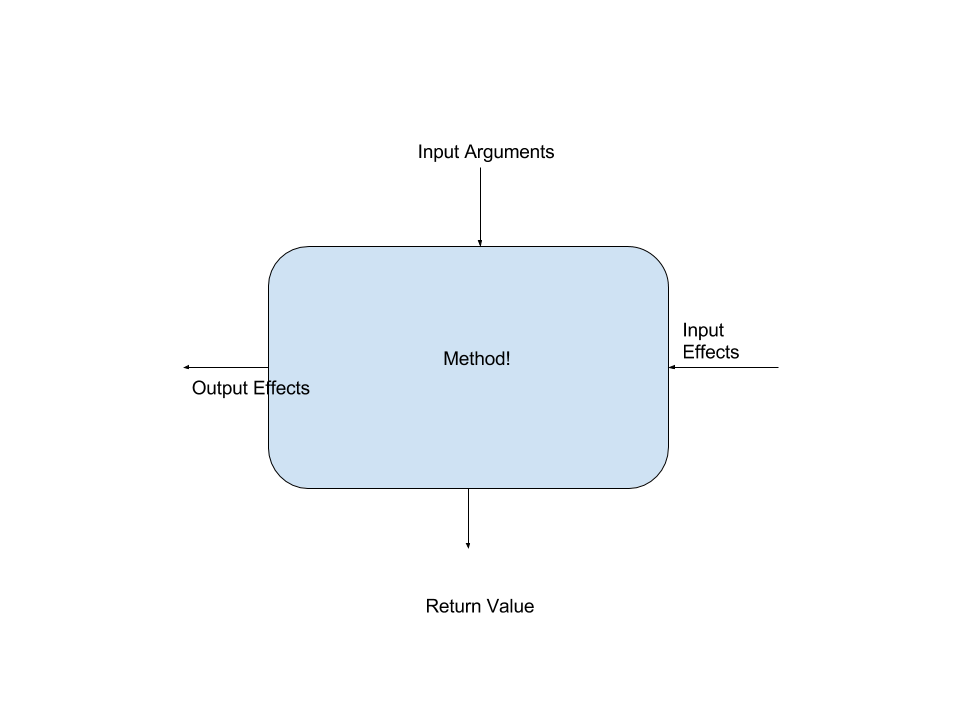

# Methods and Functions

## the unit of

### uh, doing *stuff*

Note:

So, when we talk about "doing stuff" in computer programming, we have a bunch
of different ways of organizing it. If you're writing in OOP, you'll start by
making a class, and then defining some methods on it. In functional
programming, you start by defining a data type and writing functions that
operate on it. In imperative languages, you define procedures that run a
sequence of commands on the underlying machine.


# Values and Effects

# Input and Output

Note:

Let's talk about how we *use* methods and functions. Generally, we can talk
about a function in terms of the inputs and outputs that it has. We can also
talk about a function in terms of the values and effects that it deals with.

The code in this talk will be a combination of Ruby and Haskell.


# Values

```ruby
class Foo
  def my_func(x, y)          # value!
    z = User.all.length
    FooResult.insert(x, y, z)
    x + y + z                # value!
  end
end
```

* Input arguments
* Return value

Note:

The *values* in this code snippet are the simple, easy bits. We pass in the
numbers x and y, which are both values. We return x + y + z, which is a simple
value.


# Effects

```ruby
class Foo
  def my_func(x, y)
    z = User.all.length       # effect!
    FooResult.insert(x, y, z) # effect!
    x + y + z
  end
end
```

* Input effects
* Output effects

Note:

The effects in this function are reading all of the users out of the database,
and inserting a new result into the database.


# Haskell

```haskell
module Foo where

myFunc x y = do
    z <- fmap length selectUsers
    insert (FooResult x y z)
    pure (x + y + z)
```

Note:

Haskell's purity makes it really easy to figure out what's an effect and what's
a value. In Ruby (or any other language, really) you have to either *know* or
read the entire call graph of the code you're talking about. Haskell tracks it
in the type, which makes these refactors really easy.


# Values and Effects




Note:

Values are, at a first approximation, the things we pass directly into
functions or methods, and the things that are returned directly from functions.
Input effects are the things that provide information to the function that we
don't explicitly pass in. Output effects are the things that happen as a result
of calling the method, that aren't explicitly part of the return value.


# Values are *explicit*

# Effects are *implicit*

Note:

So values are explicit. Testing values is easy, and testing is an OK
approximation of good software. Effects are implicit. And testing effects is difficult.


# Testing Values:

```ruby
def add(x, y)
  x + y
end
```

```ruby
describe "add" do
  it "should add" do
    expect(add(2, 3)).to eq 5
  end
end
```

Note:

So, here's the super simple add function. Testing it is stupid easy. We just
pass in some input values, and make assertions about the output value. This
test is pretty silly, but it's easy to come up with more advanced test cases.


```ruby
describe "Add" do
  it "is commutative" do
    100.times do
      x, y = 2.times { Random::rand }
      expect(x + y).to eq(y + x)
    end
  end

  it "is associative" do
    100.times do
      x, y, z = 3.times { Random::rand }
      expect((x + y) + z).to eq(x + (y + z))
    end
  end
end 
```

Note:

Here, we're testing that add is associative and commutative. We're taking
a random sample of values, and ensuring that we can reorder our operations and
group them however we want. These tests are *easy* to write. They're fun,
almost. And they're kinda pretty! They look extremely close to the mathematical
definitions of associativity and commutativity.

This sounds trivial, but many difficult concepts in distributed systems involve
guaranteeing properties like commutativity. Making these properties easy to test
is important.


# In Haskell, too!

```haskell
add x y = x + y

spec = 
  describe "add" $ do
    it "should add numbers" $ do
      add 2 3 `shouldBe` 5    
    prop "is commutative" $ \x y -> do
      add x y `shouldBe` add y x
    prop "is associative" $ \x y z -> do
      add x (add y z) `shouldBe` add (add x y) z
```

Note:

The tests we have for the Ruby and Haskell are just about the same! It's a
little easier to write the tests in HAskell, but we've got basically the same
thing going on.


# Testing Effects:

Note:

So you're going to read the code on these slides and you might wince. I'm gonna
be calling out some methods of testing effects that we've all done
(probably?!). So if you are feeling personally offended, just know that I've
done all of these too, and maybe I can help find a way out!


# Testing Effects:

```ruby
class Foo
  def my_func(x, y)
    z = User.all.length       # effect!
    FooResult.insert(x, y, z) # effect!
    x + y + z
  end
end
```

Note:

Testing effects is a lot harder. Suddenly we have to worry about what User is,
and what happens when we do FooResult. I'm going to evolve testing this example.


# Wrong

```ruby
describe "Foo#my_func" do
  it "adds inputs" do
    expect(Foo.new.my_func(1,2)).to eq(3)
  end
end
```

Note:

So this attempt is flat out wrong. However, on an uninitialized database with 0
users, it'll return the right answer. This is a *fragile* test, even though it
may pass sometimes.


# Wrong Haskell

```haskell
describe "Foo.myFunc" $ do
  it "adds inputs" $ do
    Foo.myFunc 1 2 `shouldReturn` 3
```

Note:

Haskell isn't going to protect us here. While we know that we have effects
going on in Foo.myFunc, that's all we know, and as long as we acknowledge that,
then GHC is satisfied. Since the correctness of this depends on something that
we are not tracking in the type, the type system can' help us!


# Slow

```ruby
describe "Foo#my_func" do
  it "adds inputs" do
    User.insert(name: "Matt", age: 28)
    expect(User.all.length).to eq(1)
    expect(Foo.new.my_func(1,2)).to eq(4)
    x = FooResult.find_by(x: 1, y: 2, z: 1)
    expect(x).to_not be_nil
  end
end
```

Note:

So this isn't wrong anymore. However, the test relies on the database state, and
has to do five SQL queries in order to verify the code. These tests are
monstrously slow and will kill your TDD cycle, in addition to being fragile and
annoying to write.


# Stubs!

Note:

The next "level up" that often happens is to take advantage of stubs or mocks.
Let's look at that real quick:


```ruby
describe "Foo" do
  it "adds some numbers" do
    x, y, z = 3, 4, 3

    expect(User)
      .to receive(:all)
      .and_return([1,2,3])

    allow(FooResult)
      .to receive(:insert).with(x, y, z)

    expect(Foo.new.my_func(x, y))
      .to eq(x + y + z)
  end
end
```

Note:

This test is a lot nicer. We need to stub out the User.all method to ensure it
returns a value that suits our expectation. We also need to stub out the
FooResult class and verify that it receives the arguments we expect. Finally, we
can do some assertions on the actual values involved.

This kinda sucks! You can imagine extending this to more complex things, but it
gets even uglier, pretty quickly. Furthermore, stubs and mocks are pretty
controversial in the OOP community. They're not a clear best practice.


# Stubs in Haskell

Note:

So stubbing global terms like this in Haskell? It's not possible. Sorry, or
not, I guess, depending on whether you find the previous code disgusting or
pleasantly concise.

I know that someone probably has some awesome hack to make top level spies or
stubbing work. I don't... really want to hear about it. Sorry! I can't be
trusted with that kind of dark magic.


# Dependency Injection?

Note:

Dependency injection is usually heralded as the solution or improvement to just
stubbing out random global names. You define an interface (or duck type) for
what your objects need and pass them in your object initializer


```ruby
class Foo
  def initialize(user, foo_result)
    @user = user
    @foo_result = foo_result
  end

  def my_func(x, y)
    z = @user.all.length        # effect!
    result = x + y + z
    @foo_result.insert(x, y, z) # effect!
    result
  end
end
```

Note:

Dependency injection can be used to make testing like this a little easier,
especially in languages that aren't as flexible as Ruby (like Haskell). Instead
of overriding a global name, you make the class depend on a parameter that's
local. Instead of referring to the global User class, we're referring to the
instance variable user which is ostensibly the same thing. This is Good, as
we've reduced the coupling in our code, but we've introduced some significant
extra complexity.  And the testing story isn't great, either:


```ruby
describe "Foo" do
  it "adds stuff" do
    x, y, user = 2, 3, double()
    user.stub(:all) { [1,2,3] }

    foo_result = double()
    foo_result.stub(:insert)

    expect(foo_result)
      .to receive(:insert).with(x, y, 3)

    foo = Foo.new(user, foo_result)

    expect(foo.my_func(x, y)).to eq(x + y + 3)
  end
end
```

Note:

This is clearly worse than before. If we're going by the metric that easier to
test code is better code, then this code *really* sucks. So dependency injection
is clearly not the obvious solution to this problem.

You can write helpers and stuff to obscure the difficulty of testing this. But
that doesn't make it *better*, it just hides the badness. Sometimes that's
great! Perfect is the enemy of good etc.


# How to even do that in Haskell

Note:

So how do we even do that in Haskell? Well, everything is just a function, so you just pass functions.


```haskell
myFuncAbstract 
    :: IO [a]               -- select users
    -> (FooResult -> IO ()) -- insert FooResult
    -> Int -> Int -> IO Int -- The rest of the function
myFuncAbstract selectUsers insert x y = do
    z <- fmap length selectUsers
    insert (FooResult x y z)
    pure (x + y + z)

myFunc = myFuncAbstract DB.selectUsers DB.insert
```

Note:

Here we make selectUsers and insert into functions that we pass in, and for the
real version, we provide the database functions. The tested version can provide 
different functions based on what you want to test.

This is about as awkward as the OOP Version! Alas.


# Values vs Objects

Note:

Are objects values? Not necessarily. Objects have a notion of identity that is
separate from the values of their member variables. By default, objects in Ruby
and most object oriented languages compare each other based on reference
equality: these two objects are equal iff they refer to the same objet in
memory. Two users, each with the same name and age, are different if they are
stored in different places in memory.


# Objects

```ruby
class User
  attr_reader :name, :age
  def initialize(name, age)
    @name = name
    @age = age
  end
end

a = User.new("Matt", 28)
b = User.new("Matt", 28)

a == b # False!
```

Note:

Here we've got a User class with name and age. We instantiate two users with the
same values. THese are different objects, and equality checking returns false for them.


# Values

```ruby
class User
  # ...
  def eql?(other)
    name == other.name && age == other.age
  end
```

Note:

Values, on the other hand, are equal if every component of the value is equal. 5
is equal to 5, regardless of where the two fives are stored in memory. This
modification to the User class converts it into a value, where two users are now
equal if their name and age are the same.


# Values

[https://github.com/tcrayford/Values](https://github.com/tcrayford/Values)

```ruby
User = Value.new(:user, :age)
```

Note:

I'm going to refer to the `Values` library. The above code creates an immutable
value object with two fields, user and age. Equality is done by comparing the
members for equality.
